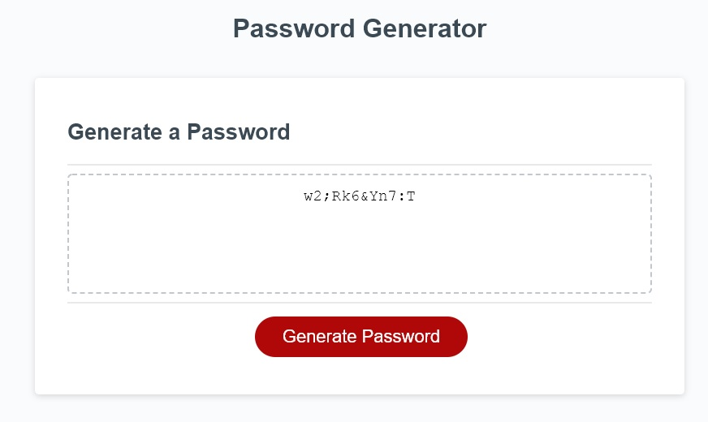

# Random Password Generator

This is a program that takes a user's inputs and outputs a random password. Depending on your inputs, you can create a very strong password. Consequently, a password that is difficult to memorize.

## Demo and Link to the Program:

[Random Password Generator](https://jacobhoss.github.io/random-password-generator/)